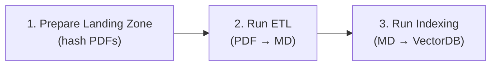
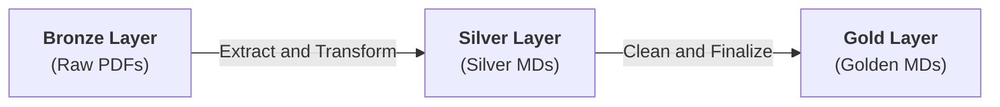
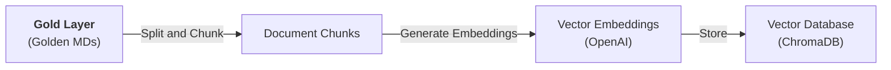

# LOSS-J

**Locate, Organize, Summarize, Suggest, and Justify**

A Retrieval-Augmented-Generation-based system for document processing and intelligent querying, designed for Portuguese military and administrative documentation.

---

## Table of Contents

- [Installation](#installation)
- [Usage](#usage)
- [Architecture](#architecture)
- [Data Lakehouse](#data-lakehouse)
- [Pipeline Components](#pipeline-components)
- [Configuration](#configuration)
- [Current Limitations](#current-limitations)

---

## Installation

### Prerequisites

- Python 3.8+
- OpenAI API key

### Setup

```bash
git clone git@github.com:sousaalexandre/loss-j.git
cd loss-j

python -m venv venv
source venv/bin/activate  
# On Windows: venv\Scripts\activate

# Install dependencies
pip install -r requirements.txt

# Configure environment
cp .env.example .env
```

Edit `.env` and add your OpenAI API key:

```ini
OPENAI_API_KEY=sk-...
```

### Optional: MinerU

To use MinerU for PDF-to-Markdown conversion, see the [MinerU documentation](https://opendatalab.github.io/MinerU/).

MinerU supports two backends:
- **`pipeline`** (local)
- **`vlm-http-client`** (remote): Faster conversion via external server (falls back to `pipeline` if unavailable or something goes wrong)

Configure the backend and server URL in [settings.py](src/settings.py):

---

## Usage

### Workflow Overview

The typical development workflow consists of three steps:



### Command-Line Scripts

Command-line scripts are the recommended approach for the development stage. They provide direct control over the ETL pipeline and are more suitable for iterating on document processing configurations.

#### 1. Prepare Landing Zone

The landing zone (bronze layer) stores PDFs with SHA-256 content hashes and maintains a `_catalog.json` file with document metadata.

Use the provided script to automatically add PDFs to landing zone.

```bash
python run_load_landing.py <path_to_pdf_directory>
```

**Example:**
```bash
python run_load_landing.py ./my_pdfs
```

The script will:
- Copy PDFs to `data_lakehouse/01_bronze/` with hashed names
- Create or update `_catalog.json` with metadata

> [!NOTE] 
> **Manual Step:** Categories are empty by default. You must fill them manually by directly editing the [_catalog.json](data_lakehouse/01_bronze/_catalog.json).

See [Data Lakehouse Standards](docs/data-lakehouse-standards.md) for the complete catalog schema.

#### 2. Run ETL Pipeline

Once the landing zone is populated, run ETL to convert PDFs to markdown:

```bash
python run_etl.py
```

#### 3. Run Indexing Pipeline

Finally, index the gold layer markdown into the vector store:

```bash
python run_indexing.py
```

> [!TIP]
> To clean or reset the vector store, simply delete the `vectorstore_db/` directory and re-run the indexing script.

### User Interface

```bash
streamlit run main.py
```

**Features:**
- **Chat**: Ask questions about your documents (knowledge base). The system retrieves relevant content and generates answers with source document references.
- **Manage Context**: Upload new PDFs and add metadata to the knowledge base. The system automatically processes them through the full pipeline (ETL → Indexing).
- **Evaluation Results**: View performance metrics. See [Evaluation](#evaluation) section for more details.

> [!WARNING]
> Development focus has been on core pipeline logic, not the web interface. **For document ingestion and indexing, use [command-line scripts](#command-line-scripts)** instead. The web interface is suitable for simple interaction (chatting) with your documents and viewing evaluation results.

### Evaluation

The RAG system includes a semantic accuracy evaluation framework to assess response quality.

#### Why Evaluate?
Different configurations of document converters and splitting strategies produce varying results. Evaluation helps identify which combination best balances accuracy, completeness, and retrieval quality.

#### How It Works
The evaluation script (`test-eval.py`) runs test queries through the RAG system and compares generated responses against reference "expected" responses. An LLM evaluates each response on **semantic accuracy** (0-100) based on:
- **Factual precision**: Is the response factually correct?
- **Completeness**: Does it cover all key points from the expected answer?

#### Results
The results table (see link below) shows that **`docling` with hierarchical splitting consistently outperforms other approaches**, achieving higher semantic accuracy scores and better document retrieval. This is now the **recommended default configuration** (`LOADER_TYPE="docling"` and `SPLITTING_TYPE="hierarchical"`).

**Running Evaluation Tests:**

```bash
python test-eval.py
```

**Configure test queries** by editing [query.json](query.json). Add test cases with `query` and `expected` fields:

```json
[
  {
    "query": "Your test question here?",
    "expected": "The ideal/reference answer"
  }
]
```

Results are saved as timestamped CSV files in [outputs/results/](outputs/results/).

See the complete results table [here](https://docs.google.com/spreadsheets/d/1PSo9qhHn55MSrnKrOmchA2SSj48x_8-9jNRj0pcXxmg/edit?usp=sharing).

---


## Architecture

### Why Two Loader Types?

The system supports two distinct document loading strategies:

| Loader Type | Input | Process | Use Case |
|-------------|-------|---------|----------|
| `pdfloader` | PDF | Direct text extraction → Indexing | Simple PDFs, faster processing |
| `mineru` / `docling` | PDF | PDF → Markdown → Cleaning → Indexing | Complex PDFs with tables, images, formulas |

**Why PDF-to-Markdown?** Converters like MinerU or Docling can extract structured information from PDFs, such as tables, headers, images, and formulas, while preserving the document structure. The PDFLoader approach extracts plain text only, losing all formatting and hierarchy.

To address these challenges, we implemented a **Data Lakehouse architecture** based on three layers to support the intermediate artifacts separately from the raw input through the final stage.

---

## Data Lakehouse

The preprocessing stage is inspired by the [**Medallion Architecture**](https://www.databricks.com/glossary/medallion-architecture) for managing document transformation before being loaded into the final layer (Gold).

See [Data Lakehouse Standards](docs/data-lakehouse-standards.md) for complete specification.

The ETL pipeline implements intelligent caching, with the goal of optimizing development:

1. **Silver Cache**: In the silver layer, some data is used as a cache, enabling the reuse of previously processed contents if the extraction mechanism (`docling` vs `mineru pipeline/vlm`) is unchanged when this layer must be rebuilt.
2. **Gold Cache**: In the same way, in the gold layer, some data is reused if cleaning settings (`ENABLE_HTML_CLEANING`, `ENABLE_HIERARCHY_REBUILDING`, etc.) are unchanged when this layer must be rebuilt.
3. **Force Clean**: Option to rebuild gold even if settings are unchanged.

---

## Pipeline Components

### 1. ETL Pipeline


[`pipeline_etl.py`](src/pipelines/pipeline_etl.py)



Transforms PDFs in the landing zone into RAG-ready markdown in the gold layer:

```python
ETLPipeline(force_clean=False).run(pdf_files)
```

**Stages:**
1. **Organize**: Hash PDFs, copy to landing zone, register in catalog
2. **Extract**: Convert PDF → Markdown using the configured converter (silver layer)
3. **Transformation**: Apply transformations such as cleaning and rebuild hierarchy
4. **Finalize**: Save cleaned markdown + assets to Gold layer

**Transformation Options** (configured in [settings.py](src/settings.py)):

These options were designed to address issues in MinerU's markdown output:
- `ENABLE_HTML_CLEANING`: Convert HTML tables to Markdown (MinerU outputs tables as HTML)
- `ENABLE_LATEX_CLEANING`: Convert LaTeX equations to text (MinerU preserves LaTeX syntax)
- `ENABLE_HIERARCHY_REBUILDING`: Fix document header levels (MinerU has limited hierarchy extraction)
- `HIERARCHY_REBUILDING_MODE`: "font" (PDF analysis) or "llm" (AI-based)

### 2. Indexing Pipeline
[`pipeline_indexing.py`](src/pipelines/pipeline_indexing.py)



Indexes documents into the vector store:

```python
RAGIndexingPipeline(use_etl=True).run()
```

**Stages:**
1. **Load**: Read markdown from Gold layer or PDFs from Bronze Layer if `use_etl=False`
2. **Split**: Chunk documents using the configured splitter strategy
3. **Embed**: Generate embeddings via OpenAI
4. **Store**: Upsert into ChromaDB vector store

**Splitting Strategy** (configured in [settings.py](src/settings.py)):

- **`"recursive"`**: Basic recursive text splitter. Splits on newlines and spaces without awareness of document structure. Fastest but loses semantic boundaries.
  
- **`"markdown_recursive"`**: Markdown-aware splitter. Respects markdown structure (headers, lists, code blocks) when creating chunks. Better semantic cohesion than recursive splitting.
  
- **`"hierarchical"`**: Hierarchical splitter. Leverages document hierarchy (headers, sections, subsections) to create semantically meaningful chunks. **Requires well-structured markdown with clear hierarchy levels.** Currently, only `docling` is capable of extracting sufficient hierarchy information to fully benefit from this strategy. MinerU output has limited hierarchy extraction.

**Splitting Parameters:**
- `CHUNK_SIZE`: Characters per chunk (default: 1000)
- `CHUNK_OVERLAP`: Overlap between chunks (default: 200)

### 3. Ingestion Controller 
[`pipeline_ingestion_controller.py`](src/pipelines/pipeline_ingestion_controller.py)

Orchestrates the complete pipeline:

```python
run_ingestion(pdf_files, file_metadata, progress_callback)
```

**Modes:**
- **ETL Mode** (e.g. `LOADER_TYPE="mineru"` or `"docling"`): Runs ETL → Indexing
- **Direct Mode** (`LOADER_TYPE="pdfloader"`): Skips ETL, indexes PDFs directly

**Features:**
- Duplicate detection (skips already-indexed files)
- Progress callbacks for UI integration
- Metadata preservation through catalogs

### 4. Inference Pipeline
[`pipeline_inference.py`](src/pipelines/pipeline_inference.py)

Handles user queries:

```python
query_handler(prompt) → {"response": str, "documents": list}
```

**Process:**
1. **Embed**: Convert user query to vector embedding
2. **Retrieve**: Fetch top-K similar documents from vector store
3. **Construct**: Build prompt with retrieved context and original query
4. **Generate**: Send prompt to LLM and generate response
5. **Return**: Return response with source document references

---

## Configuration

All settings are centralized in [`settings.py`](src/settings.py):

---


## Current Limitations

1. **Web Interface is Basic**
   - The Streamlit interface works but is not production-ready. It lacks polish and advanced features.
   - Use command-line scripts for document processing workflows.

2. **Images Are Not Used in RAG**
   - Images are extracted (if using mineru) and stored in Gold bundles but are not included as context in responses.
   - Future versions may add image understanding capabilities.

3. **MinerU Has High Hardware Requirements**
   - MinerU demands significant computational resources.
   - **Recommendation:** Use `docling` instead, which is lighter, faster, and produces better results (per evaluation tests).

---

[https://doi.org/10.54499/2024.07619.IACDC](https://doi.org/10.54499/2024.07619.IACDC)
